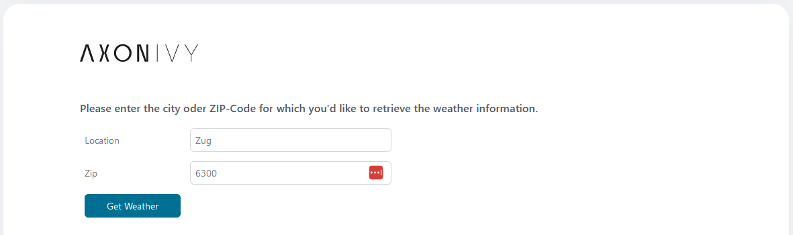

# srf-weather-connector

Axon Ivy’s [SRF](https://developer.srgssr.ch/api-catalog/srf-weather) Weather data API
connector helps you query weather forecasts

The connector:

* provides various weather data such as next seven day forecasts and more.
* supports you with an easy-to-copy demo implementation to reduce your
  integration effort.
* enables low code citizen developers to enhance existing business processes
  with currency converter features.

## Demo

Install the SRF Weather Connector and call it as a sub-process. Adjust the mapping accordingly.


In the demo, you can now specify either the name of the location or its ZIP code and use the "Get Weather" button to output the weather for the next seven days at this location.


If the location is valid, the corresponding output looks like this:


## Setup

To use the connector, you must select a suitable API package via the [SRF API Developer website](https://developer.srgssr.ch/api-catalog/srf-weather) and generate a "bearer token". 
This is described in the following instructions: [SRF instruction](https://developer.srgssr.ch/getting-started/easy-description-get-accesstoken)

After a Bearer Token is available, you can store it in the Connector project in the variable "myBearerToken"(under Config-->variables.yaml).


```
@variables.yaml@
```