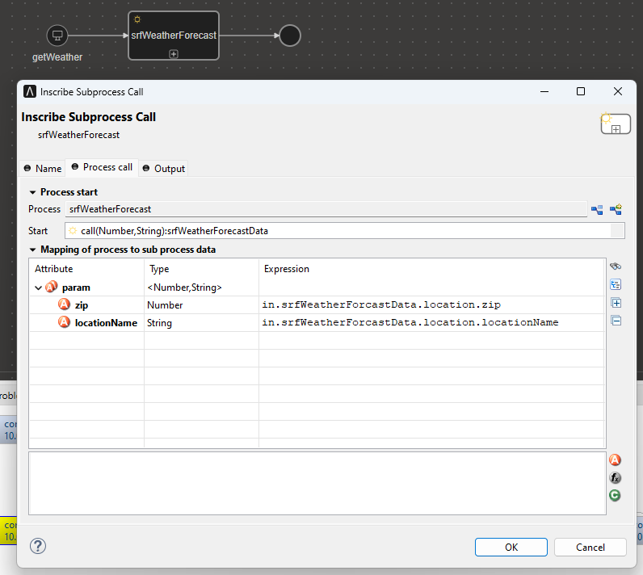
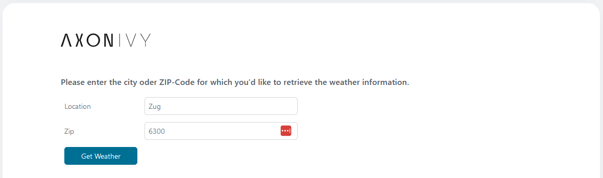

# SRF-Wetter-Konnektor

Mit Axon Ivy's [SRF](https://developer.srgssr.ch/api-catalog/srf-weather) Wetterdaten API kannst Du Wettervorhersagen in Deine Prozessdaten einbinden.

Der Konnektor:

* stellt verschiedene Wetterdaten bereit
* visualisiert die Wetterdaten als Sieben-Tage-Vorhersage
* unterstützt dich mit einer Demo-Implementierung, um deinen Integrationsaufwand zu reduzieren.

## Demo

Install the SRF Weather Connector and call it as a sub-process. Adjust the mapping accordingly.


For testing purposes, a mock API can be used in the demo instead of the official SRF API. For this purpose, the variable "Url" can be commented out under 'Variables.SrfWeatherConnector'. 
This way you can avoid the need to generate an access token via the SRF Developer website first. In this mock mode, only the ZIP code "6300" must be entered in the "zip" field.

In the demo, you can now specify either the name of the location or its ZIP code and use the "Get Weather" button to output the weather for the next seven days at this location.


If the location is valid, the corresponding output looks like this:


## Setup

The use of the SRF Weather API is not free of charge. For development purposes there is a free version with minimal API calls.
To use the connector, you must select a suitable API package via the [SRF API Developer website](https://developer.srgssr.ch/api-catalog/srf-weather) and generate a "bearer token". 
This is described in the following instructions: [SRF instruction](https://developer.srgssr.ch/getting-started/easy-description-get-accesstoken)

After a Bearer Token is available, you can store it in your project in the variables.yaml as the variable "srfWeatherConnector.Token" (as you can see in the Demo).
1. Register an account on [developer.srgssr.ch/](https://developer.srgssr.ch/).
2. Once logged in, click Apps on the top right and add a new app with the "+ ADD APP" button.
3. After the app is created, you will receive a Consumer Key and Consumer Secret with which you can generate the Bearer Token.
4. Store the API-Key/Token in your variables.yaml under `Variables.SrfWeatherConnector.Token`

```
@variables.yaml@
```

