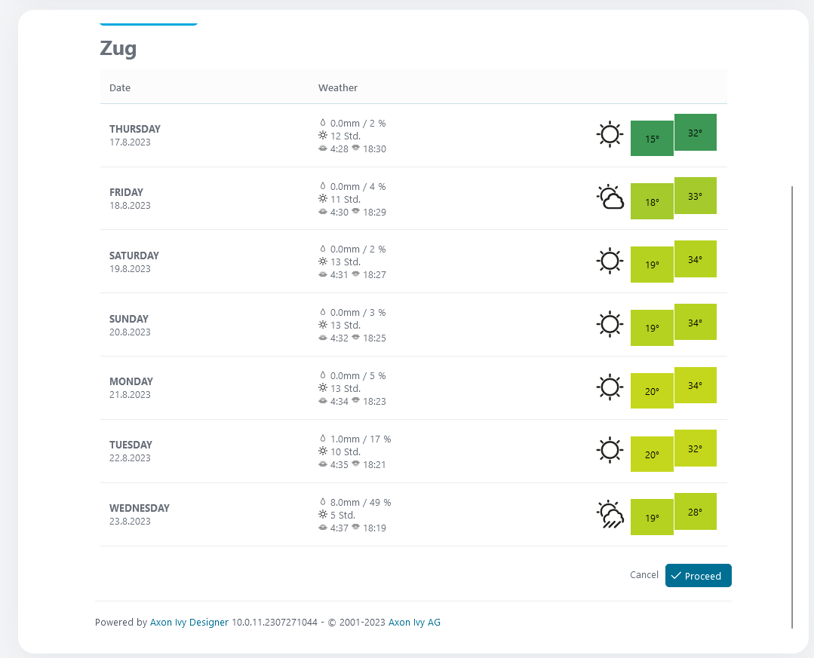

# srf-weather-connector

Mit der Wetterdaten-API
[SRF](https://developer.srgssr.ch/api-catalog/srf-weather) von Axon Ivy können
Sie Wettervorhersagen für die Schweiz in Ihre Prozessdaten integrieren.

Der Konnektor:

* liefert verschiedene Wetterdaten
* Visualisieren Sie die Wetterdaten als Sieben-Tage-Vorhersage.
* unterstützt Sie mit einer Demo-Implementierung, um Ihren Integrationsaufwand
  zu reduzieren.

## Demo

Installieren Sie den SRF Weather Connector und rufen Sie ihn als Unterprozess
auf. Passen Sie die Zuordnung entsprechend an. 

Zu Testzwecken kann in der Demo anstelle der offiziellen SRF-API eine Mock-API
verwendet werden. Zu diesem Zweck kann die Variable „Url” unter
„Variables.SrfWeatherConnector” auskommentiert werden. Auf diese Weise können
Sie vermeiden, dass Sie zunächst über die SRF-Entwickler-Website einen
Zugriffstoken generieren müssen. In diesem Mock-Modus muss nur die Postleitzahl
„6300” in das Feld „zip” eingegeben werden.

In der Demo können Sie nun entweder den Namen des Ortes oder dessen Postleitzahl
angeben und mit der Schaltfläche „Wetter abrufen“ das Wetter für die nächsten
sieben Tage an diesem Ort anzeigen lassen. 

Wenn der Speicherort gültig ist, sieht die entsprechende Ausgabe wie folgt aus:


## Setup

Die Nutzung der SRF Weather API ist nicht kostenlos. Für Entwicklungszwecke gibt
es eine kostenlose Version mit minimalen API-Aufrufen. Um den Konnektor nutzen
zu können, müssen Sie über die [SRF API Developer
Website](https://developer.srgssr.ch/api-catalog/srf-weather) ein passendes
API-Paket auswählen und ein „Bearer Token” generieren. Dies wird in der
folgenden Anleitung beschrieben: [SRF
Anleitung](https://developer.srgssr.ch/getting-started/easy-description-get-accesstoken)

Sobald ein Bearer Token verfügbar ist, können Sie es in Ihrem Projekt in der
Datei variables.yaml als Variable „srfWeatherConnector.Token” speichern (wie in
der Demo zu sehen).
1. Registrieren Sie ein Konto auf
   [developer.srgssr.ch/](https://developer.srgssr.ch/).
2. Sobald Sie angemeldet sind, klicken Sie oben rechts auf „Apps” und fügen Sie
   mit der Schaltfläche „+ APP HINZUFÜGEN” eine neue App hinzu.
3. Nachdem die App erstellt wurde, erhalten Sie einen Consumer Key und einen
   Consumer Secret, mit denen Sie das Bearer Token generieren können.
4. Speichern Sie den API-Schlüssel/Token in Ihrer Datei „variables.yaml” unter „
   `Variables.SrfWeatherConnector.Token”.`

```
@variables.yaml@
```
